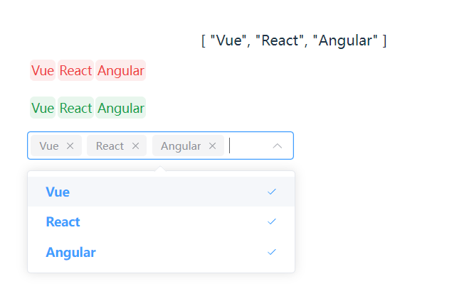

# ElTagInput

基于vue+vite+elementplus+vueuse实现的一个标签输入器




## 安装

```bash
```

## 使用

```vue
const selectedTags = ref<string[]>(['Vue', 'React', 'Angular']);

...

<el-tag-input tag-color="#ef4444" 
              width="600px" 
              v-model:value="selectedTags" 
              placeholder="请添加标签"></el-tag-input>
```

## 参数
- `tag-color` 标签颜色
- `width` 宽度
- `placeholder` 占位符
- `v-model:value` 绑定值
